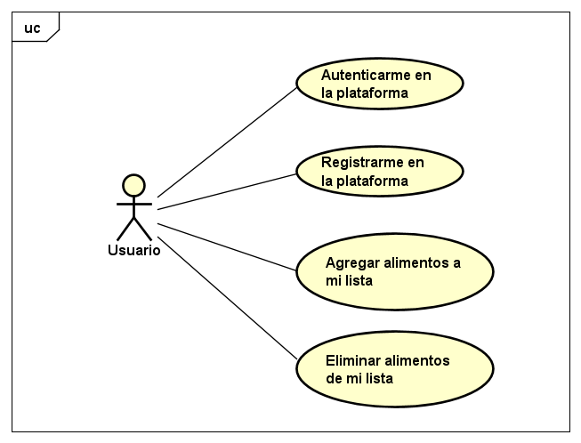

### Escuela Colombiana de Ingeniería
### Testing y Aseguramiento de Calidad de Software - TACS

# Food App

## Integrantes

  * Daniel Felipe Alfonso Bueno
  * Steven Nikolai Bermudez Vega
  * Juan Carlos Garcia Garzón
  * Johann Sebastian Paez Campos
  * Daniel Felipe Walteros Trujillo

## Descripción

  Food App es una aplicación para gestionar tu lista de mercado, puedes registrar todo lo que quieras y para crear una cuanta solo debes tener nombre de usuario y contraseña.

## Casos de Uso

### Autenticarme en la Plataforma
#### Descripción

  Un usuario debe registrarse para hacer uso de la aplicación, para ello debe realizar un proceso de "login" con su nombre de usuario y clave.
  
#### Precondiciones

  El usuario debe estar registrado en el sistema
  
#### Flujo Normal

  1. El usuario accede a la URL principal.

  2. El sistema solicita credenciales.
  
  3. El usuario ingresa proporcionando su nombre de usuario y clave.
  
  4. El sistema valida las credenciales de acceso y redirige a la página principal de la aplicación.

#### Excepciones

  E1. El usuario ingresa mal sus credenciales. El sistema notifica el error. 
  
#### Post-Condiciones

  El usuario accede a la aplicación y tiene acceso a las funcionalidades de la misma.
  
### Registrarme en la Plataforma
#### Descripción

  Un usuario debe registrarse para hacer uso de la aplicación, para ello debe crear una cuenta con su nombre de usuario y clave.
  
#### Flujo Normal

  1. El usuario accede a la URL principal.

  2. El usuario accede a la opción de "crear una cuenta".
  
  3. El sistema redirige a la página de creación de usuario.
  
  4. El sistema solicita nombre de usuario y clave para crear una cuenta.
  
  5. El usuario proporciona nombre de usuario, clave y elige la opción de crear cuenta.
  
  6. El sistema notifica la creación del usuario.
  
  7. El usuario se dirige a la URL principal y se registra con las credenciales.
  
#### Flujo Alternativo 1

  5. El usuario no proporciona nombre de usuario o clave.

  4. El sistema notifica que hay campos faltantes.

#### Excepciones

  E1. (A1). El usuario ingresa un nombre de usuario ya registrado. El sistema notifica el error. 
  
#### Post-Condiciones

  El usuario crear su cuenta y ahora puede autenticarse.
  
### Agregar alimentos a la lista
#### Descripción

  Un usuario esta en la capacidad de agregar alimentos a su lista.
  
#### Flujo Normal

  1. El usuario se autentica en la plataforma.

  2. El usuario proporciona el nombre del alimento.
  
  3. El usuario selecciona la opción de agregar alimento.
  
  4. El sistema agrega el alimento y actualiza la página.
  
#### Flujo Alternativo 1

  5. El usuario no proporciona el nombre del alimento.

  4. El sistema notifica que hay campos faltantes.
  
#### Post-Condiciones

  El usuario visualiza el alimento recien agregado.
  
### Eliminar alimentos a la lista
#### Descripción

  Un usuario esta en la capacidad de eliminar alimentos de su lista.
  
#### Flujo Normal

  1. El usuario se autentica en la plataforma.

  2. El usuario elige el alimento que va a eliminar.
  
  3. El usuario selecciona la opción de eliminar del alimento seleccionado.
  
  4. El sistema elimina el alimento y actualiza la página.
  
#### Post-Condiciones

  El usuario ya no visualiza el alimento recien eliminado.

